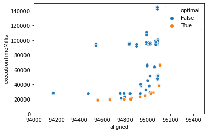
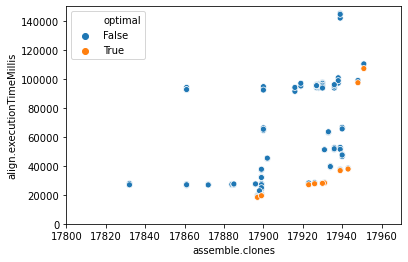

# Что случилось

MiXCR с настройками по умолчанию — оптимизирован под максимально широкий спектр типов данных. Однако, за это приходится платить скоростью выполнения, т.к. "перебирается" куча возможных архитектур сиквенса и выравниватели настроены максимально чувствительно.

Имея же конкретные данные в уме, можно отключить часть "угадывалок" и огрубить часть выравнивателей. Я вчера сделал это для данных нашего стандартного ДНК мультиплекса, т.к. Митя сказал, что проблема со скоростью стала критичной.

# Что получилось

Стадию выравнивания удалось ускорить почти в **5 раз**. А суммарно, т.к. выравнивание — не единственная стадия, весь пайплайн для например 2 млн ридов ускорился с 10 мин 4 cек до 2 мин 51 сек (примерно в **3.5 раза**).

Вот результаты для старого стандартного пайплайна и для нового — оптимизированного, тут важные строчки из репорта и полное время выполнения

### Было
```
Alignment time: 9.19m
Successfully aligned reads: 1902627 (95.13%)
Final clonotype count: 29287
Reads used in clonotypes, percent of total: 1804058 (90.2%)

real    10m4.375s
user    67m11.414s
sys     0m54.188s
```

### Стало
```
Alignment time: 1.89m
Successfully aligned reads: 1895354 (94.77%)
Final clonotype count: 29338
Reads used in clonotypes, percent of total: 1804904 (90.25%)

real    2m51.045s
user    14m18.884s
sys     0m18.485s
```

Кроме ускорения, в данном примере, MiXCR с новыми настройками зачерпывает чуть больше разнообразия. Это происходит за счет более чувствительного выравнивателя J генов. В данных ДНК мультиплекса J участок — короткий, и, кроме того, в области праймера в нем достаточно много мутаций (классическая картина, т.к. при синтезе праймера возникает обычно много ошибок).

Количество выравниваний сократилось за счет выкидывания всякого трэша со стороны V гена. Важно, что количество продуктивных выравниваний, которые доходят до формирования клонов чуть возросло, а не упало.

# Что сделали

1. За основу были взяты настройки для выравнивания B-клеток, которые называются `kAligner2`, этот набор настроек использует относительно новый, одноименный выравниватель. Такой выбор был сделан, т.к. благодаря куда более элегантному устройству алгоритмов, у него должен быть гораздо больший потенциал находить сложные выравнивания за меньшее время. Единственная проблема с ним была — что у нас не дошли руки оптимизировать его настройки под реальные задачи, ... вот, собственно, и настал тот день.
    
    В полу-ручном режиме было сгенерировано много наборов настроек (я просто написал скрипт, который перебрал, в разумном диапазоне, настройки, которые я знаю — должны влиять на производительность), для них для всех был запущен анализ на 100к ридах из случайно взятого файла с ДНК мультиплекс данными.

    По результатам был построен [Парето-фронт](https://en.wikipedia.org/wiki/Pareto_efficiency#Pareto_frontier) относительно времени выполнения и количества построеных выравниваний и клонов (отдельно).

   

   

   После этого была стадия пристального вглядывания в результаты анализы, и выравнивания, которые были построены новые и потеряны относительно эталонного файла, полученного с дефолтными настройками.

2. Далее было ликвидировано два источника переборов, путем введения новой настройки и изменения одного параметра.
   - т.к. библиотека ориентированная и мы точно знаем как — можно не искать в противоположном стренде (это, к сожалению, не ускоряет процесс в два раза, т.к. алгоритм и раньше быстро соображал, что в одном из стрендов ловить нечего, но все-таки процентов 15 прироста дает)
   - второй сложно описать без картинки, а рисовать неохота

# Как этим пользоваться

На сервера загружена новая сборка MiXCR в которую этот набор настроек встроен. Вот как выглядит пример команды выравнивания:

```bash
mixcr -V 400a \
    align -p dna.multiplex.rstrand.v1 -f --species hs \
    -t 8 -n 1000000 \
    /ngs/2020/09_FMBA_NovaSeq_DNA/540001930808_S48_L001_R1_001.fastq.gz /ngs/2020/09_FMBA_NovaSeq_DNA/540001930808_S48_L001_R2_001.fastq.gz \
    tst1.vdjca
```

тут важны `-V 400a` - чтобы использовать новую пред-релизную версию MiXCR и `-p dna.multiplex.rstrand.v1` собственно активирующий этот набор настроек.

Для использования новых настроек через `analyze` надо делать как-то так:

```bash
mixcr -Xmx20g -V 400a \
    analyze amplicon -s hsa -t 8 \
        --json-report tst \
        --align-preset dna.multiplex.rstrand.v1 \
        --align "-n 2000000" \
        --assemble -OseparateByJ=false \
        --adapters adapters-present --starting-material dna --5-end v-primers --3-end j-primers \
        /ngs/2020/09_FMBA_NovaSeq_DNA/540001930808_S48_L001_R1_001.fastq.gz /ngs/2020/09_FMBA_NovaSeq_DNA/540001930808_S48_L001_R2_001.fastq.gz \
        tst_new
```

опции `--align-preset ...` раньше не было, она добавлена в этой версии. 